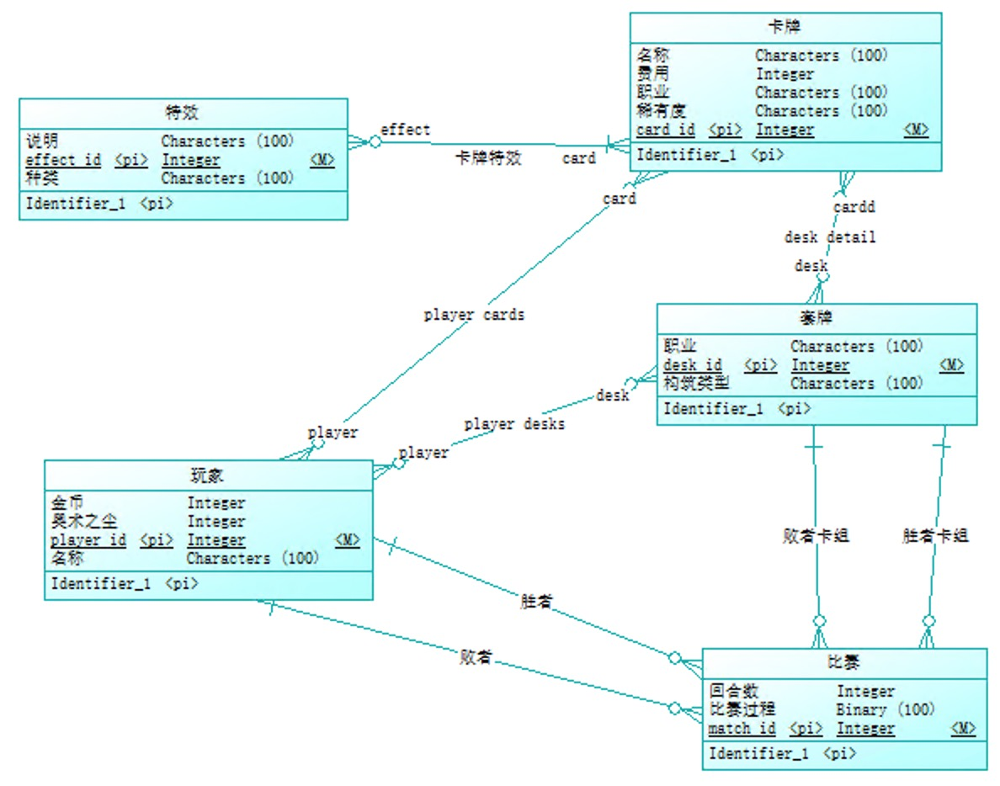
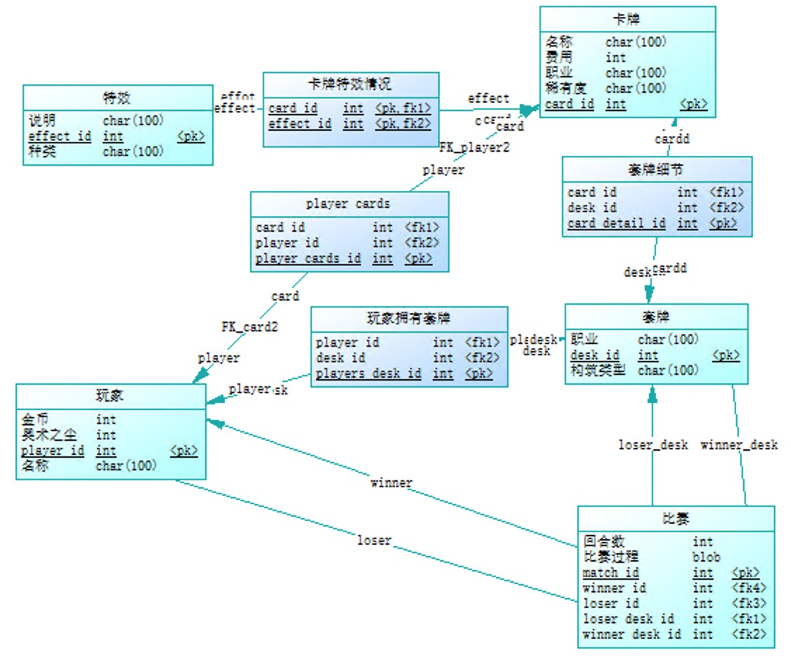

#### 北京大学 信息科学技术学院 数据库系统概念 课程设计报告

# Fake HeathStone Replay

### 参与同学：庄博尔   学号：1600012775

摘要：本课程使用mysql以及flask设计了一个类似于[hsreplay.net](hsreplay.net)的网站，使用了sql语言完成了对炉石传说卡片，牌组，对战的一个管理，并尝试了sql的一些高级特性，如事务，视图，索引等。在实现这个项目的过程中学得了要如何设计，运行，管理一个数据库应用。

## 引言

本项目的灵感来源于与同学交流课程设计内容时得出的，再结合最近[《炉石传说》](https://playhearthstone.com/en-us/)新冒险开启，便希望实现一个类似于hsreplay.net的卡牌数据分析网站，希望通过分析玩家，卡牌，牌组，对战来练习数据库的操作，提高自己对数据库的认识。

本课程设计实现了以下的几个功能：

1. 登记卡牌，牌组以及玩家的细节
2. 对卡牌，牌组的细节的查看与筛选
3. 对对战的一个登记网页

本文分为五个部分，在第二部分中，我们介绍了本课程设计需要的背景知识、包括项目设计工具，实现水时使用的前端后端工具以及提高sql执行效率，正确性的一些方法；第三部分描述了课程设计的系统框架；第四部分给出相关的关系数据库模式和相应的操作；第五部分总结了全文，并且叙述了完成本课程设计的收获。

本课程设计代码可在https://github.com/NewGod/Fake_HSR获得

## 相关工作

本项目在设计部分使用了[power designer](https://www.sap.com/products/powerdesigner-data-modeling-tools.html)来生成ER图以及产生初步的sql语句。在实现部分，前端使用了python的一个网络微框架[flask](http://flask.pocoo.org/)，[mysql](https://www.mysql.com/)来作为后端的数据库，并使用了[pymysql](https://pymysql.readthedocs.io/en/latest/)来作为python与mysql通信的工具。在mysql的设计方面，我们应用了sql中的外键和事务管理来保证sql语句执行的正确性。在sql的执行效率方面，我们使用了视图以及索引来加速sql的查询和插入。同时为了防止sql的注入攻击，我们也用了pymysql内置的一些方法以及设计来避免攻击。

## 课程设计的系统框架

《炉石传说》是一个卡牌游戏，两位玩家利用自己已有的卡牌，在九个职业中选择一个以及30张卡牌组成一套牌组来进行对战。我们希望分析玩家，牌组之间的对战情况，并提供对牌组，卡牌的快速查找。为了完成上述的功能，我们需要记录卡牌，牌组，对战记录以及用户的信息，并分析牌组与牌组，玩家与玩家之间的对战信息。

经过设计，其UML用例图如下：

其各个用例的简要介绍如下：

* 查询卡牌：用户可以进行对卡牌的查询并提供一定的筛选功能。（如查询某职业，某种花费的卡牌）
* 查询卡组：用户可以通过查看卡组列表来确定哪种卡组拥有比较高的胜率，并查看某个卡组的具体细节。
* 记录对战信息：用户可以记录自己的对战信息。
* 查看用户信息：用户可以查看自己的个人对战信息，查看某次对战的对战细节。
* 登记信息：管理员可以在后台实时的添加卡牌，卡组，用户的信息。
* 数据库记录：数据库提供了相应的登记功能。
* 数据库查询：数据库提供相应的查询功能。

在实现部分，处于方便，快捷的原因，我们决定使用python语言来作为其服务器语言，用一个网络微框架flask来提供服务，前端部分使用html以及一些简单的javascript来搭建网页。在后端部分，我们使用了Mysql来作为数据库，利用pymysql来作为与数据库通信的接口，这是因为其方便配置，同时在之前的课程中也已经使用过的原因。

在实际工作中，由于时间问题，我们并没有实现查看用户信息以及查看对战细节这两个部分的内容。这两个部分的查询比较简单而且实现方式与其他用例的实现方式较为相同故没有实现。

## 课程设计对应的关系数据库模型

### ER图

为了设计出一个合理的关系数据库模型，我们先采用Powerdesigner来设计一个实体关系模型。在本设计中一共有五个实体：特效，卡牌，卡组，比赛，玩家。其中特效这个实体是因为一张卡牌拥有多种特效，因此将其抽离成为一个实体比较好，其他四个实体不需要做太多的说明。

这五个实体之间有下列的关系：卡牌拥有特效，卡组由卡牌组成，比赛有胜者败者及他们的卡组，玩家拥有属于自己的卡牌以及卡组，在进行了上述的探讨之后，我们可以得到下面的ER图：

### 关系数据库模式描述

利用Power Designer提供的生成关系数据库，我们可以得到其关系数据库模型：

该关系数据库模型有9个表，其中大部分表使用一个自增的目录来作为其主键，不使用自增目录其他表的原因为要保持其外键的唯一性，故用其外键来作为相应的主键。这个模型的设计达到了第四范式的要求。

在视图设计上，我们创建了三个视图：卡组特效视图用来加快在做卡牌筛选时的速度；对战卡组视图用来加快对对战卡组的统计，快速得出卡组的对战信息；玩家卡组视图用来加快寻找对应玩家卡组的速度。同时也使用了几个索引加速对某些表格查询，排序的速度和效率。

### 关系数据库模式之上的操作

下面我们将说明我们是如何利用这个关系数据库来实现在第三章提到的各种功能的。

1. 数据库初始化：我们利用[click](https://click.palletsprojects.com/en/7.x/python3/)库注册了一个新的命令，python读入初始化的sql文件并交给mysql执行。
2. 登记信息：由于登记信息是由管理员进行的，因此我们用命令行来实现登记卡牌，卡组以及玩家信息。具体来说，我们利用click库注册了一个新的命令，管理员可以将卡牌，卡组以及玩家信息以json文件的形式保存下来。该程序自动读取json文件并进行信息的登记。每次新增信息时，将实体数据储存进数据库，然后在进行询问获得其关系索引，将关系存储进数据库。
3. 查询卡牌：查询卡牌由一个网页进行，网页读取用户所要筛选的卡牌信息并将后端的数据展示出来。对于后端，我们在收到网页传递过来的信息后，构建出查询需要的sql语句并交给mysql进行查询。由于查询中包括对特效信息的查询，应此我们创建一个卡牌特效视图来加速查询速度。
4. 查询卡组：查询卡组同样在一个网页上进行，网页实时展示每个卡组参与的相关信息以及其参加的比赛数量以及胜率，如果对某个卡组感兴趣，可以点击查看该卡组的细节。为了完成这些操作，后端需要将卡组信息以及比赛信息结合起来，处于加速这个过程的考虑，我们将这个网页需要的信息用一个视图存储起来。
5. 记录对战信息：记录对战信息需要玩家填入胜者，败者及他们的卡组。为了避免出现玩家使用不存在的卡组，我们在选择玩家后再进行查询获得其拥有的卡组，这一步也可以使用视图来进行加速。

同时，为了保证每个功能的原子性，我们使用了SQL中的事务特性，对mysql的插入和查询进行了封装，保证每一个操作不会因为出现错误而半途中断。我们还仔细的研究了各种细节，利用pymysql中自带的字符串转换函数以及各种类型检查，防止sql注入攻击。

## 总结

这次的数据库概论期中课程设计，我们利用flask和mysql实现了一个对《炉石传说》卡牌，牌组，对战，玩家的管理和统计网站，利用ER图和相关工具来对数据库进行设计和管理，并尝试了许多数据库的高级特性，查询了相关资料防止sql的注入攻击。

通过执行这次期中课程设计，我在这之中学会了很多。学会了如何更好的使用PowerDesigner以及另外的一个ER图绘制工具[ERDPlus](https://erdplus.com/)，虽然在上一次作业中已经尝试使用过了，但是更加深入的使用这个软件会对ER图有更深刻的理解。同时，由于这次不只是设计一个数据库同时还要实现它，在实现的时候会遇到很多的问题，例如很多关系可能不是唯一的，不能直接把外键作为主键，这导致在实现的过程中需要回去修改原来的设计。

同时我也了解到了利用python开发一个数据库应用的一些更好的方法。由于老师的要求，这次的课程设计一定要使用sql语言来进行，但在查找资料的过程中我也了解到了许多非传统型数据库，比如[MongoDB](https://www.mongodb.com/)，同时对于传统型数据库也有很多数据库框架能够更好的面向对象编程，如[sqlalchemy](http://www.sqlalchemy.org/)，这些框架虽然不像直接使用mysql语言那样快速，灵活。但由于其面向对象的特性使得能够更快的进行开发。今后遇到相似的问题时我很愿意去使用这些新工具。

同时在数据库之外，这次课程设计也让我尝试了许多的新工具，第一次使用flask来做网络框架，第一次使用pymysql来控制数据库，第一次使用[pipreqs](https://github.com/bndr/pipreqs)来生成相关的库依赖文件。这对我的编程水平也是一次提高。

## reference

1. 炉石传说官方网站 https://playhearthstone.com/en-us/
2. HSReplay.net https://hsreplay.net/
3. SAP PowerDesigner https://www.sap.com/products/powerdesigner-data-modeling-tools.html
4. Flask [http://flask.pocoo.org/](http://flask.pocoo.org/)
5. Mysql https://www.mysql.com/
6. Pymysql https://pymysql.readthedocs.io/en/latest/
7. Click https://click.palletsprojects.com/en/7.x/python3/
